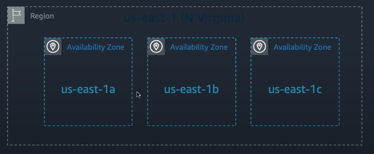

# Week 1 – Network Foundation of AWS

This week focuses on the essential networking components in AWS that form the backbone for secure, high-performing, and highly available cloud applications. Understanding these concepts is crucial for building architectures that are scalable, resilient, and cost-efficient.

---

## What is AWS
- AWS provides a highly reliable, scalable, low-cost infrastrucutre platform in the cloud (190 countries)
### Benefits
- Optimize Cost
- Elasticity and Agility
- Open and Flexible
- Secure
- Global Reach
### CloudFront
- Points of Presence with 230+ center for caching static file - like image, video, etc. 
### Availability Zone 
- A region is comprised of multiple AZ (typically 3)

### Cost Management
- Tools: Cost Explorer, Budgets, Cost and Usage Report
- People: AWS Account Team, AWS Concierge, Enterprise Support
- Features: Reserved (Like buying combo package)
