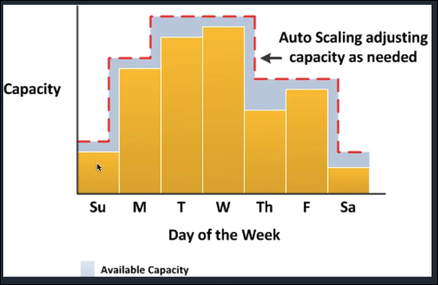
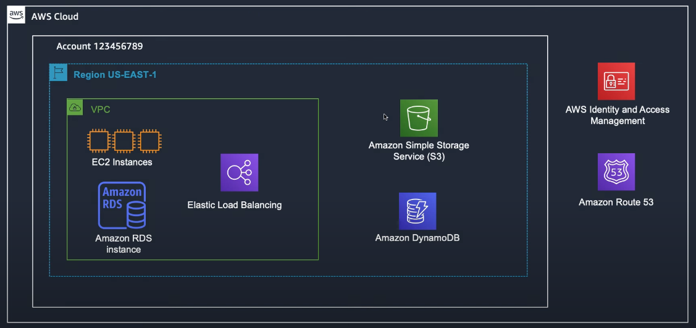

# Week 1 – Network Foundation of AWS

This week focuses on the essential networking components in AWS that form the backbone for secure, high-performing, and highly available cloud applications. Understanding these concepts is crucial for building architectures that are scalable, resilient, and cost-efficient.

---

## What is AWS
- AWS provides a highly reliable, scalable, low-cost infrastrucutre platform in the cloud (190 countries)
### Benefits
- Optimize Cost
- Elasticity and Agility
- Open and Flexible
- Secure
- Global Reach
### CloudFront
- Points of Presence with 230+ center for caching static file - like image, video, etc. 
### Availability Zone 
- A region is comprised of multiple AZ (typically 3)

### Cost Management
- Tools: Cost Explorer, Budgets, Cost and Usage Report
- People: AWS Account Team, AWS Concierge, Enterprise Support
- Features: Reserved (Like buying combo package)
### AWS Budgets
- Set custom budgets that alert you when your cost or usage exceed (or are forecasted to exceed) your budgets amount. (You can also set RI Utilization alerts)
- Alerting can send to email or SNS Topic, from SNS it can execute the logic base on your setting (for example: >50$ then shutdown or stop an EC2)
- Cost and Usage Report
    - A CSV Report with the most comprehensive AWS cost and usage information
    1. Deliver report to S3
    2. Ingest into Database
    3. Conduct detailed analyses
- Base Practices:
    - Tagging: Use AWS Config rules to mandate tagging (Cost Center, Business Unit, etc)
    - Cost Visibility: Dashboard to track AWS cost (Cost Explorer Report, Amazon Redshift, QuickSight, Athena + QuickSight, Custom Databases and BI tools)
    - Automation: Automate cost controls using Budgets, SNS and Lambda (From AWS Budgets, send message to message queue SNS, and trigger the Lambda function to execute your logic)
- [AWS Pricing Calculator](https://calculator.aws/)
- The Five Pullars of Cost Optimization
    - Rightsize your resources
        - Cheapest Instance / Best Performance
        - [Tool: Compute Optimizer](https://aws.amazon.com/compute-optimizer/getting-started/)
            - Migrate/provision and run
            - Check (CPU, RAM, network, disc)
            - Rightsize
            - Review performance
            - Saving money :D
    - Increate elasticity
        - Auto scaling
        
    - Pick the right pricing model
        - Reserved Instances (RI) and Savings Plans (SP)
            - Billing Subscription ('discount coupon' applied hourly)
            - 1yr or 3yr term commitment to pay for all hours for a reduced price
            - Doesnt reserve actual capacity (except for RIs with Zonal scope)
            - Saving up to 75%
        - EC2 Spot
            - Stateless, Fault-tolerant, Big data, Containers, CICD, Web servers, High Performance Computer, Dev/Test
            - Up to 90% Saving
            - Use for application that can be downtime (for example: many clone services, 1 service that have many server - if dead 1 or 4 still good)
        - On Demand
            - You pay as you go
    - Optimize storage
        - Block: Amazon Elastic Block Store, EC2 Instance Store
        - File: Amazon Elastic File System
        - Object: Amazon Simple Storage Service, Amazon S3 Glacier
    - Measure, monitor and improve
        - Summary of Mechanisms for Optimisation
            - Define, agree, and enforce cost allocation tagging
            - Define metrics, set targets, and review
            - Enable teams to architect for cost
            - Assign optimization responsibility
### Regions and Availability Zones (AZs)
#### AWS VPC Overview

- Virtual Private Cloud is the User Config Network, only assets inside vpc can communicate with others (also inside it).
- The storage (S3 or DynamoDB) will be outside VPC, by sendind request through API to it to use
- Some service is outside of Region (like AWS Identity and Access Management, Amazon Route 53 - Domain Name System service)

#### Subnets and AZs
[Route Tables - Internet Traffic](assets/week1/internet_traffic.png)
- 1 subnet inside 1 az (1 to 1)
- In subnet will have the route table (in each subnet), which can go local inside VPC (if target setting is local)
- If want to communicate outside the VPC (to the internet) have to go through Internet Gateway, and setting in Subnet Route Table destination to ip address and target is id of internet gateway

[Internet Access for Private Subnets - NAT Gateway](assets/week1/nat_gateway.png)
- When a subnet can communicate 2 ways (internal and internet) call Public subnet, and the private subnet only communicate with inside VPC - For simple, a public subnet is the subnet which have route table can communicate with internet gateway
- For each created subnet will cost some IP (private IP and public IP), in VPC will also have the VPC DHCP (for assigning IP address) and VPC DNS (mapping domain name with ip) (reserved for AWS use: 10.0.0.0-3)
- NAT gatewat will be inside the Public subnet and communicate with Internet through Internet gateway, so if the private subnet want to go out to internet, the private route table should config destication and target the the NAT gateway in public subnet which will forward the request from private subnet to the internet (or internet gateway)

[Multi-AZ Best Practices](assets/week1/multi_az.png)
- The best practice is split many services in multiple AZ in VPC, and in each AZ will have public subnet for web server to communicate with load balancer and database in private subnet

[Security Groups - Reference other groups](assets/week1/security_group.png)
- If you have the EC2 in a subnet, it will have the virtual internet card (Inbound Rules and Outbound Rules). The default Inbound Rules will block all the incomming request, so we have to config the inbound rules for it to receive request (Example Protocol: TCP, Port: 80, Source: 0.0.0.0/0) and database in another security group will only inbound from webserver (that mean database will only receive the request from EC2 Webserver - Example: Inboud Rules: TCP 3306 sg-webserver) 
- Network Access Control Lists (NACL) is a stateless firewall, which you have to config the in and outbound rules (default will open all in and out request).

[VPC Building blocks Summary](assets/week1/vpc_building_blocks.png)

[VPC Peering](assets/week1/vpc_peering.png)
- In real-life, we will have multiple VPC (and multiple account for big corp client).
- Inside 1 VPC, all the service can connect with others (default route table setting). We will need a Peering Connection VPX-123 to connect 2 VPC together (and also have to connect Route Table in 2 VPC)
[VPC Peering - No Transitive Routing](assets/week1/vpc_peering_no_transitive_routing.png)
[AWS Site-to-Site VPN](assets/week1/aws_site_to_site_vpn.png)
- In a site to site VPN, we should follow the default config of AWS (create a Virtual Private Gateway VGW-123 and a Customer Gateway). Config the Customer Gateway to connect to Virtual Private Gateway through IPSec (Internet)
- Site-to-Site VPN support for multi connection 

[AWS Direct Connect](assets/week1/aws_direct_connect.png)
- Site to site config will go through internet. Internet is not stable so we should using direct connect (currently AWS partner with FPT, Viettel to create Direct Connect)
- If migrate a data center to cloud, you can elastical scale the direct connect bandwith for a short time.

[Transit Gateway and Direct Connect Gateway](assets/week1/transit_gateway_direct_connect_gateway.png)
- In real-life, there are multiple Data Center and Multiple VPC. So the AWS Transit Gateway and AWS Direct Connect Gateway as a middleware for config the connection between multiple Data Center and VPC.