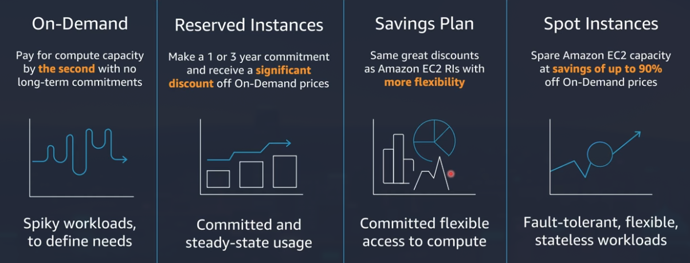

# [Week 2 - Storage and Compute on AWS (Youtube)](https://www.youtube.com/watch?v=bTf8K5Nz6lU&t=2850s)
## Table of Contents
**Storage**
- AWS Storage Overview
- Simple Storage Service
- Storage Gateway
- AWS Backup
**Compute**
- Amazon EC2
- Container Technology
- Amazon ECS
- Amazon EKS
- Amazon Fargate / ECR
## AWS Storage Overview
AWS delivers broadest storage portfolio in industry

- Object: Object storage to store media, video, etc.
    - Amazon S3
- Block
    - Amazon EBS
- File
    - Amazon EFS: for Linux
    - Amazon FSx for Windows File Server
    - Amazon FSx for Lustre: High performance
- Backup: For Backup Data on AWS, 
    - AWS Backup
- Data Transfer and Edge Processing
    - AWS Storage Gateway
    - AWS Data Sync
    - AWS Transfer Family
    - AWS Snowmobile
    - AWS Snowball
    - AWS Snowcone
### What are customers building
- Backup and Restore
    - Non-disruptive
    - Easy place to start
    - Integrated with all major vendors
- Archive and Compliance
    - Media workflows
    - Tape replacement
    - Public Sector, FinServ, Healthcare/Life Sciences
- Home Directories
    - Simple to move
    - Less latency sensitive
    - Significant cost savings
- Data Lakes
    - Variety of analytics tools
    - Foundation for AI/ML
    - Built for streaming data
    - Data visualization
- Modern Apps
    - Persistent storage for Containers, Serverless
- Business Critical Applications
    - Integrated with major vendors
    - Fully managed infrastructure
    - Life and shift migration

### Backup, Restore, and Archive
- All backup and archive: AWS Storage Gateway (Optional), mainly use Amazon S3
- Database Backup: Amazon FSx For Windows File Server and Amazon EFS for Linux

### Data Lakes
In the traditional env, data is in column type and transfer to datawarehouse to create platform for data analyse. But current data is in type of log, user behaviour, or crawling from social so we need the place to temp storing that data.
- Consolidate all your data
- Process and analyzes
- Simplified data lake formation
- Machine Learning

### Modern Applications
In tradition env, we deploy the application to the computer, later is the dockerize and microservices on many services/server. To decrease the managemnet pressure of container, they switch to serverless where deploying code on the Cloud Provider. And the quality and make sure the code run is managing by Cloud Provider - we will be using many service like EFS, Lambda Function or ECS/EKS/Fargate Container.

### Business-Critical Application
For example, the core function of many business system will have block storage (Amazon EBS/EFS/FSx for Windows) with options to run (with config, setting).

## Simple Storage Service
S3 is the one of first service in AWS (before EC2).
S3 is focus on the durability of data, when uploading data to storage its crucial to be durability the data. And scalability is a really important for scaling (to TB or more).
All the data on S3 will organize horizontal, distribute to many storage nodes.
Also, AWS have service to analyse the data from S3 (to get insights), it help the mini-data platform built on s3 really easy and user-friendly. In security, we can also pushing logging data to s3

*Understanding durability*
In S3, the durability is up to 99.99999999% because data on S3 will have copied and clone in 3 differences AZ. But for elastic blockstore it only in 1 AZ (3 clone)
*Options for data transfer*

The price of cloud will calculate base on from the service output to outside internet. So when upload data to S3 is free (income). Some snowball and stuff is not really wellknown in vietnam, its like copy in the hard drive and ship to your address.
*Security in S3*
Trusted Advisor will help scanning (free) in AWS account to have any vulnerabilities.
**S3 Default Encryption** will be default on S3, and it have the permission really strict in the service for external access (need key)
*S3 Block Public Access*
For eaxmple when you want to private, you can block the public access
*S3 Access Point*
Before you upload the data to S3, you need to create a s3 bucket. All the data uploaded will be horizontal.
If you want to share the data (categorise) to many team, you can create the shared buckeds for each team (decentralize teams data lakes cross-account data exchange)
*S3 Access Analyzer*
An S3 capability to generate comprehensive findings if your resource policies grant public or cross-account access
It will scan the S3 is there any vulnerabilities in access config and it will send report to warning
*S3 storage classes*

You can config life cycle policy for S3 storage class.
The left will expensive, right will cheap but cheap mean that the data crawling will be slow
You should analyse the documents and your user usage to know which class should use
S3 Intelligent-Tiering, if you have the small scale, you should focus on classify your s3. S3 Intelligent Tiering will automate do it for you

## Storage Gateway
### The hybrid cloud model
You have on-premises data and applications
[Hybrid Cloud Model](assets/week2/hybrid_cloud_model.png)
In Vietnam we dont have the data center yet. Because of that some specific case need the low latency so we should store data on-premise. If you want to have safer data storing on cloud, aws create the hybrid cloud model
*Hybrid Storage use cases*
It can use for scaling, or use for disaster recovery. Or the starter to migrate and move to AWS

### Architecture

From the application server push the data to storage gateway and the side-to-side vps is from storage gateway to storage gateway managed service
*Storage Gateway Family*
- File Gateway: Store and access objects in Amazon S3 from file-based applications with local caching
    - Is for gateway mostly use file, not changing data in the file
- Volume Gateway: Blcok storage on-premises backed by cloud storage with local caching, Amazon EBS snapshots, and clones, integrated with AWS Backup.
    - SAN (Storage Area Network) like with cloud recovery 
- Tape Gateway: Drop-in replacement for physical tape infrastructure backed by cloud storage with local caching
    - Easily switch tape backups to AWS.
### File Gateway
Store and access objects in Amazon S3 from file based applications with local caching
You config you file through protocol NFS or SMB push to the File Gateway. Push HTTPS to AWS Cloud in File Gateway and File Gateway will push to Amazon S3. Lifecycle for example some months it will push the data to class (cold storage, more cheaper)

### Volume Gateway
Block stoage on-premises backed by cloud storage
We push the data to volume gateway from application server through iSCSI and volume gateway will push to the Volume Gateway throught HTTPS, it push data to Amazon S3 and the AWS backup will match/convert into EBS using AWS Backup

### Tape Gateway
it will push to Tape Gateway throught iSCSI VTL and Tape Gateway push to AWS Gateway. After that the tape data will store in S3 (Tape Library) and eject to Tape Archive (S3 Glacier)

## AWS backup
AWS backup is create to replace the software in previous. its a fullyt managed, policy based backup service that makes it easy to centrally manage and automate the backup of data across AWS services
- Services: EBS, EFS, RDS, DynamoDB, Storage Gateway, EC2, Aurora

*AWS Backup Support*

*Backup policies*

## EC2 Overview
### Choices of Compute
- EC2: Virtual server instances in the cloud
- ECS, EKS, and Fargate: Container management service for running Docker on a managed cluster of EC2
- Lambda: Serverless compute for stateless code execution in response to triggers
### Amazon EC2
- OS: Linux | Window | Mac
- Arm and x86 architectures
- General purpose and workload optimized
- Bare metal, disk, networking capabilities
- Packaged | Custom | Community AMIs
- Multiple purchase options: On-demand, RI, Spot
*EC2 Host Virtualization*

*Resource allocation*
- All resource assigned to you are dedicated to your instance with no over commitment
    - All vCPUs are dedicated to you
    - Memory allocated is assigned only to your instance
    - Network resources are partitioned to avoid "noisy neighbors"
- Curious about the number of instances per host?
    - See [Dedicated Hosts Configuration Table]() for a guide
*Which hypervisor do AWS use*
- Original host architecture: Xen-based
    - Hypersisor consumed resources from the underlying host
    - Limited optimization
- AWS Nitro Hypervisor: Customer KVM based hypervisor
    - AWS Nitro System (launched on Nov 2017)
    - Less server resources used, more resources for the customer
    - AWS optimized
- Bare metal: Direct access to processor and memory resources
    - Built on the AWS Nitro system
    - Enables customer hypervisors and micro-VM runtimes
*AWS Nitro System*

*EC2-Specific Credentials*
- EC2 key pairs
    - Linux - SSH key pair for first-time host login
    - Windows - Retrieve Administrator password
- Standard SSH RSA key pair
    - Public/Private Keys
    - Private keys are not stored by AWS
*Broadest and deepest compute platform choice*

-

-

*What is an Amazon Machine Image (AMI)*
Provides the information required to launch an instance
Launch multiple instances from a single AMI
An AMI include the following
- A template for the root volume (for example, os, applications)
- Launch permissions that control which AWS accounts can use the AMI
- Block device mapping that specifies volumes to attach to the instance
*Purchasing Option*

*AWS Compute Optimizer*
- Applies insights from millions of workloads to make recommendations
- Saves time comparing and selecting optimal compute resources for your workload
- Recommends 3 optimal instance options for EC2 and EC2 Auto Scaling groups from 140+ instances from M, C, R, T and X families
- Available at no additional charge
-

## Container Technology
- ECS: Elastic Container Service
    - Powerful simplicity
    - To manage the ECS cluster, do not need many time or complicated set up. It easy to use but this service is also use by big clients (like banks, etc.)
- EKS: Elastic K8S Service
    - Open flexibilty
    - The kubernetes is more flexibility, with many plug in and open source to integrate to EKS. More features and ECS but it more complicated and cost more time and human resource to run and maintain
### AWS Fargate
Underlying technology for container management
- No cluster or infrastructure to manage or scale
- Everything is handled at the container level
- Scale seamlessly on demand
When using ECS or EKS, instead of manage the server hand by hand, you just config the amount and container to Fargate and it will automately handle and scaling, managing containers for you. It will cost you with the amount of resource the containers used.
### Container Registry - Amazon ECR
- Fully Managed
- Secure
- Highly Available
- Simplified Workflow
### ECS Architecture

You can run EC2 instance on different AZ if want (or need :D)

# [Week 2 - Databases and Storage Foundation (Special Force Portal)](https://specialforce.awsstudygroup.com/#/learn/week-2:-database-and-storage-foundation/lecture/07739b09-acd6-42d0-8329-613386d0abd3)
