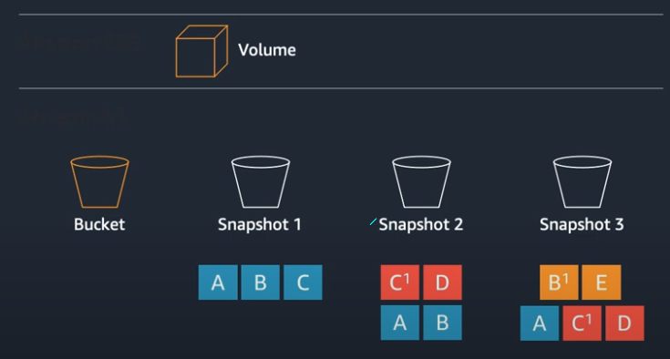

# [Week 3 - Database and Security services on AWS (Youtube)](https://www.youtube.com/watch?v=Zdai0f0yf-I&t=2s)

## Table of contents
- Relational Databases on AWS
- Database Migration
- Propose-Built Databases
- DynamoDB
- Data Lake Introduction
- Shared Responsibility Model
- AWS Identity and Access Management
- AWS Organization
- AWS Single Sign-On
- Compliance and Security Center

---
## Relational Databases on AWS

---
### Amazon RDS
Managed relational database service with a choice of six popular database engines
- Easy to administer: No need for infrastructure provisioning or installing and maintaining database software
- Available and durable: Automatic Multi-AZ data replcation; automated backup, snapshots, and failover
- Highly scalable: Scale database compute and storage with a few clicks with no application downtime
- Fast and Secure: SSD storage and guaranteed provisioned I/O; data encruption at rest and in transit

#### Amazon RDS - fully managed
Spend time innovating and building new apps, not managin infrastructure
- You: Schema design, Query construction, Query optimization
- AWS:
    - Automatic fail-over
    - Backup and recovery
    - Isolation and security
    - Industry compliance
    - Push-button scaling
    - Automated patching and upgrade
    - Advanced monitoring
    - Routine maintenance

#### Monitoring RDS/Aurora databases
- Amazon CloudWatch:
    - CPU/Memory/IOPS/Network
    - Per minute metric storage in Amazon CloudWatch
- Amazon RDS Enhanced Monitoring
    - Process/Thread list
    - Per second metric storage in Amazon CloudWatch Logs
- Amazon RDS Performance Insights
    - SQL/State/User/Host ("Database Load)
    - Per second metric storage in Amazon RDS

#### Performance Insights increase productivity
Amazon RDS Performance Insights measures database load overtime
Easy to identify database bottlenecks
- Top SQL/most intensive queries
Enables problem discovery
Adjustable timeframe
- Hour, day, week, and longer
Available for all Amazon RDS database engines

#### RDS Features
##### Multi-AZ deployments
Fault tolerance across multiple data centers
- Automatic failover
- Synchronous replication
- Anabled with one click

##### Read Replicas
RDS for MySQL, PostgreSQL, MariaDB, and Oracle
- Relieve pressure on your master node with additional read capacity
- Bring data close to your applications in different regions
- Promote a read replica to a master for faster in the event of disaster

Read replica can promote to become primary in-case we need, it is cross region also.

##### Automated backups
- Schedule daily volume backup of entire instance
- Archive database change logs
- 35-day maximum retention
- Minimal impact on database performance
- Taken from standby when runing Multi-AZ

***Every day during your backup window, RDS creates a storage volume snapshop of your instance***

***Every five minutes, RDS backs up the transaction logs of your database***

##### Database snapshots
- Always incremental
- Amazon S3 -> 99.9999999999% durability
- Supports encryption
- Copy across accounts, across regions

---
### Amazon Aurora

***You asked for a cost-effective, enterprise database...***

So, we designed Aurora - enterprise database at open source price, delivered as a managed service
- Speed and availability of high-end commercial databases
- Simplicity and cost-effectiveness of open source databases
- Drop-in compatibility with MySQL and PostgreSQL
- Simple pay as you go pricing

*Amazon Aurora is fast... up to 5x the throughput of MySQL; 3x the throughput of PostgreSQL*

#### Traditional Database Architecture
Databases are all about I/O...

Design principles over the last 40+ years:
- Increase I/O bandwidth
- Decrease number of I/Os consumed

#### Scale-out, distributed, multi-tenant storage architecture
- Purpose-built log-structured distributed storage
- Storage volume is triped across hundreds of storage nodes
- Storage nodes with locally attached SSDs
- Continuous backup to Amazon S3

#### Tolerating compute failures
- Any reader node can be promoted to writer/primary
- Failed instances/nodes will be replaced after failover and come online as readers

---
## Database Migration
**Overview**
- Simple to use
- Reliable
- Supports widely used databases
- Low cost
- Fast and easy to setup

---
### Supports widely used databases
| Source Database | Target Database |
|-----------------|-----------------|
| Oracle | Oracle |
| Microsoft SQL Server | Microsoft SQL Server |
| AzureSQL | AzureSQL |
| PostgreSQL | MySQL |
| MySQL | Amazon Redshift |
| SAP ASE | SAP ASE |
| MongoDB | AmazonS3 |
| Amazon S3 | Amazon DynamoDB |
| IBM DB2 | Amazon Kinesis |
| | Amazon ElasticSearch |

| Set up a migration task in minutes |
|------------------------------------|
| Connect to the source database |
| Connect to the target database |
| Create a replication instance to run the migration |
| Create a task |
| Run a task |

---
### AWS Schema Conversion Tools (SCT)
*The AWS Schema Conversion Tool helps automate many database schema and conversion tasks when migrating to a new database engine*

***Features***
- Schema conversion between database engines
- Database Migration Assessment report for choosing the best target engine
- Code browser that highlights places where manual edits are required

---
### AWS Purpose-Built Databases
***The best tool for a job usually differs by use case***

=> Built new applications with purpose-built databases

---
## Propose-built Databases

---
### Amazon Case Study

Amazon DynamoDB supports mutiple high-traffic sites and systems including Alexa, the Amazon.com sites, and 442 Amazon fulfillment centers. ***Across the 66-hour 2020 Prime Day, these sources made 16.4 trillion calls to the DynamoDB API, peaking at 80.1 million requests per second***

The internal Amazon.com Herd system support 100s of millions of active workflows

Migrated from Oracle to DynamoDB:
- Improved customer experiece: Workflow processing delays dropped from 1 second to 100 milliseconds
- Reduced cost: Scaling and maintenance effort dropped 10 times
- Reduced complexity and risk: Retired more than 300 Oracle hosts

---
## DynamoDB

---
### Item Distribution

---
### Path of a PutItem request

---
## Data Lake Introduction

***Companies are increasingly embracing data driven decision making and fostering an open culture where the data is not siloed within departments***

**Changing Requirements for Analytics**

I want to support for:
- Any scale, cocurrency with low cost high throughput & performance
- Data from new sources streaming, batch, real-time
- Increasingly diverse types of data
- Democratization of data - usage by many people of various skills, make it easy run and operate
- Choice of tools, techniques, and applications

---
### Using the Right Tool for the Task

---
### Serverless data lakes and analytics

---
### AWS Glue - Data Catalog

- Automatically discovers data and stores schema
- Catalog makes data searchable, and available for ETL
- Catalog contains table and job definitions
- Computes statistics to make queries efficient

---
### AWS Glye - ETL Service

- Automatically generates ETL code
- Code is customizable with Python and Spark
- Endpoints provided to edit, debug, test code
- Jobs are scheduled or event-based
- Serverless

---
### QuickSight

***Create Beautiful, Interactive Dashboard***
- Add rich interactivity like filters, drill downs, zooming, and more
- Blazing fast navigation
- Accessible on any device
- Data Refresh
- Publish to everyone with a click

---
### Shared Responsibility Model

### Meet your own security objectives

---
### Under the AWS Shared Responsibility Model

***AWS Responsibility***
- Installing camera systems to monitor the physical datacenters
- Shredding disk drives before they leave the datacenter
- Preventing packet sniffing at the hypervisor level
- Securing the internal network inside the AWS datacenters
***Customer Responsibility***
- Configuring the Security Group rules that determine which port are open on the EC2 Linux instance
- Patching the operating systm with the lastest security patches
- Toggling on the Server-side encryption feature for S3 buckets

---
## Identity and Access Management

***... the management of individual principles, their authentication authorization, and privileges ...with the goal of increasing security and productivity while decreasing cost, downtime and repentitive tasks (Wikipedia)***

---
### AAA with AWS

- Authenticate:
    - IAM Username/Password
    - Access Key
    - (+ MFA)
    - Federation

- Authorize
    - IAM Policies

- Audit
    - CloudTrail

---
### AWS Principles
- Account Owner ID (Root Account)
    - Access to all subcribed services
    - Access to billing
    - Change Account settings, change AWS support plan, close AWS account
    - Register as a seller, sign up for GovCloud
- IAM Users, Groups and Roles
    - Access to specific services
    - Access to console and/or APIs
    - Access to Customer Support (Business and Enterprise)
- Temporary Security Credentials
    - Access to specific services
    - Access to console and/or APIs.

---
### AWS Identity Authentication

***Authentication: How do we know you are who you say you are?***

---
### AWS Authorization and Privileges
***Authorization: What are you allowed to do?***

---
### AWS IAM Hierarchy of Privileges

***Enforce principle of least privilege with Identity and Access Management (IAM) users, groups, and policies and temporary credentials.***

---
### AWS Identity and Access Management (IAM)

***Securely control access to AWS services and resources for your users***

---
### AWS Directory Service

***Managed service for Active Directory***

Use your existing Corporate Credentials for
- AWS-based applications
- AWS Management Console
---
- Managed Microsoft AD
    - Based on Microsoft Active Directory in Window Server 2012 R2. Supports adding trust relationships with on-premises domains. Extend your schema using MS AD
- Simple AD
    - A Microsoft Active-Directory compatible directory powered by Samba 4
- Ad Connector
    - Connect to your on-premises Active Directory. Integrates with existing RADIUS MFA solutions

---
## AWS Organization

---
### What is an AWS account

---
### Isolation with IAM and VPC in one account?

- "Gray" boudaries
- Complicated and messy overtime
- Difficult to track resources
- People stepping on each other

---
### Concepts and terms

- Management account
    - Account used to create the organization (payer account)
    - Central management and governance hub
    - Minimal Resources
- Organization unit (OU)
    - Set of AWS accounts logically grouped within an organization
- Policy
    - Document describing controls to be applied to a selected set of accounts

---
### AWS accounts and organizational units (OUs)

- Segment your applications and workloads into AWS accounts
- Group accounts into OUs to simplify management
- Create multiple OUs within a single organization
- Nest OUs inside other OUs to form a hierarchical structure
- OU design should reflect policy and governance needs, not organiztional structure

---
### Multi-account framework

---
## Organizations Workflows

---
### Create an account

- Create a new AWS account and join the organization in one step
    - No manual sign-up required
    - No billing set up or credit-card required
    - Cross-account Admin role created automatically
- Account still has Root credentials
    - Unique email address required
    - Perform password recovery and enable MFA outside of Organizations

---
### Invite an existing account

- Specify email addresses or Account IDs to invite
    - Account owner must accept invitation via Organizations console
- Effect on existing account
    - No account access role created automatically
    - SCPs take effect immediately
    - Organizations-integrated StackSet maybe deployed
    - Organization Config rules or Confirmance Packs may be applied

---
### Remove an account or leave an organization

- Can be initiated by either the management account or the member account
- Requires account to be responsible for its own billing
    - Credit card or other payment instrument must be set up
    - AWS Cusotmer Agreement msut be accepted
    - Support Plan and Contact Information must be complete

---
### Deleting an organization

- Initiated by the Management Account
- All the member accounts must be removed from the organization
- Deletes the organization, including:
    - Organizational Units
    - Service Control Policies
    - Tag Policies
    - Organizations service integration
- Management account become a standalone account
- All Management account resources remain intact

---
## Service Control Policies (SCP)

---
### Service Control Policies (SCPs)

- Define the maximum avaialable permissions for IAM entities in an account
- SCPs do not grant permission
- Attach SCPs to the organization root, OUs, and individual accounts
- SCPs attached to the root and OUs apply to all OUs and accounts inside of them

---
### Service Control Policies (SCPs) Examples

- Changing the root user's password
- Creating, updating, or deleting root access keys
- Enabling or disabling multi-factor authentication on the root user
- Creating, updating, or deleting x.509 keys for the root user

---
## AWS IAM Identity Center

---
### What do customers want to do?

- Manage Identities and Access: Manage isolation and fine-grained permissions for AWS actions and resources across accounts
- Seamless Integration: Take advantage of integrated services offering SSO to business apps, AWS apps, services, and console access
- Simplify: Provision, manage, and provide users iwith access to business cloud application

---
### What challenges are they facing
- Managing Access: Managing access and user permissions across AWS accounts can be difficult to scale 
- Seamless Integration: Existing SSO solution don't offer deep AWS integration
- Business Justification: Traditional SSO software is complex, expensive, and requires expert knowledge

---
### Challenges of Individual Account Management

***Admin tasks in every account***
- Create cross-account trusts
- Create SAML trust
- Create roles and attach policies
***Admin tasks at identity provider***
- Create SAML trust to each account
- Create assertion rules that match roles in AWS

---
### Introducing IAM Identity Center

- Easy Management: Easily manage AWS account and role access at scale
- One logon: One Sign-In experience for cloud business applications
- First Party Application Integration: One Sign-In for intergrated applications.AWS IoT SiteWise Monitor, Amazon SageMaker Notebooks
- CLI: SSO from Command Line Interface (CLI)
- Existing IdP: Bring your own identities, or create them natively

---
### AWS Single Sign-On Use Cases

1. Manage access to AWS accounts and role
2. Manage access and sign-in to AWS SSO integrated applications
3. Manage access to cloud-based business applications
4. Increase developer productivity with AWS Command Line Interface v2

***One AWS access control model; You choose your identity source***

---
### Choose your Identity Store

Select your identity provider and centrally manage your users and groups

Synchronize attribute changes from identity provider using SCIM

---
### Define and Manage Permissions

- Uses AWS Organizations to retrieve your list and structure of accounts
- Define permissions using standard syntax and tools
- Definitions and policies automatically deployed and maintained in member accounts

---
### Getting Started

---
## Compliance and Security Center

---
### AWS Compliance

---
- AWS Security Center: Comprehensive security portal to provide a variety of security notifications, information, and documetation
- AWS Resources: Developer Information, Articles and Tutorials
- Subcribe to the blog - it's a great way to stay up-to-date on AWS security and compliance

